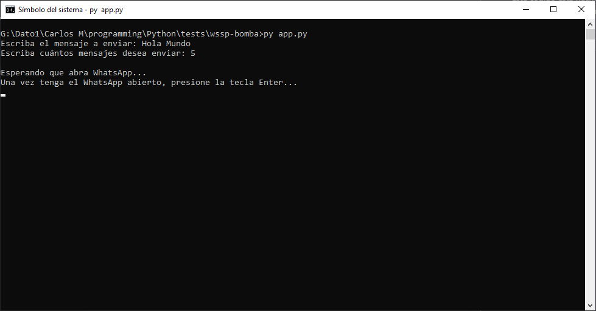
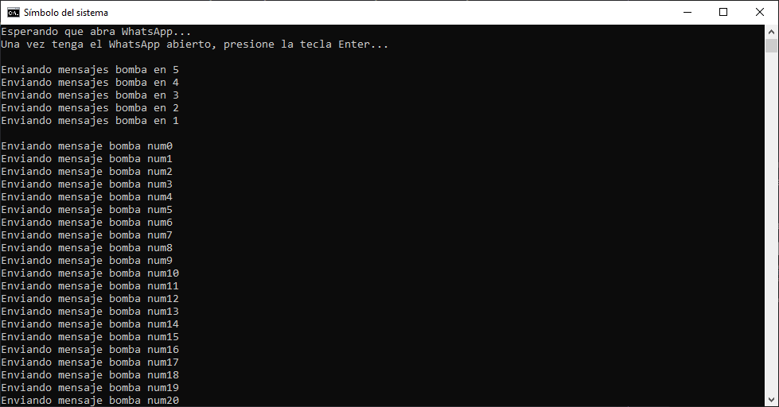
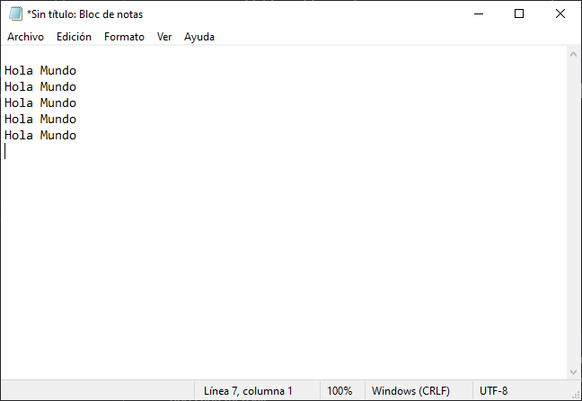
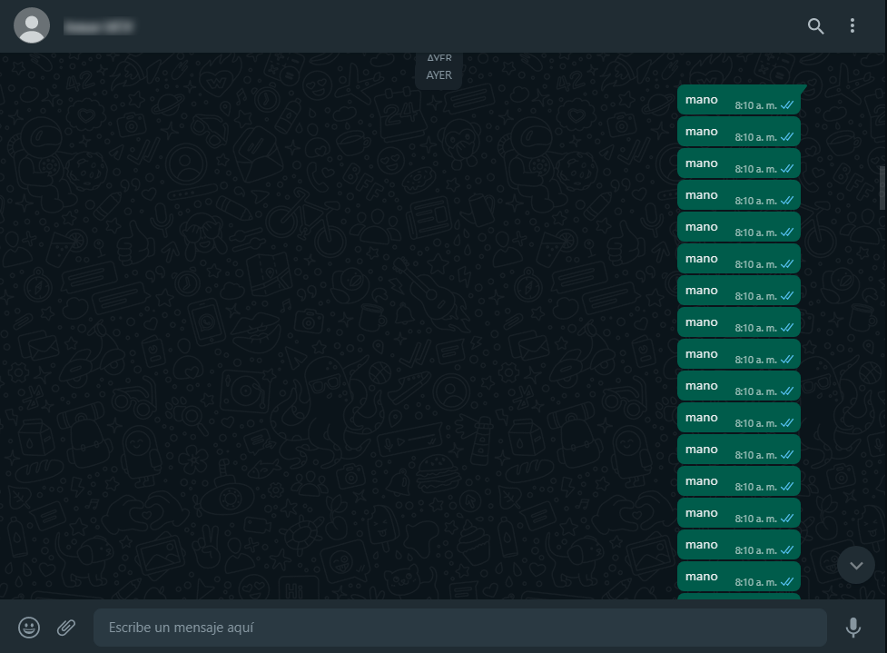
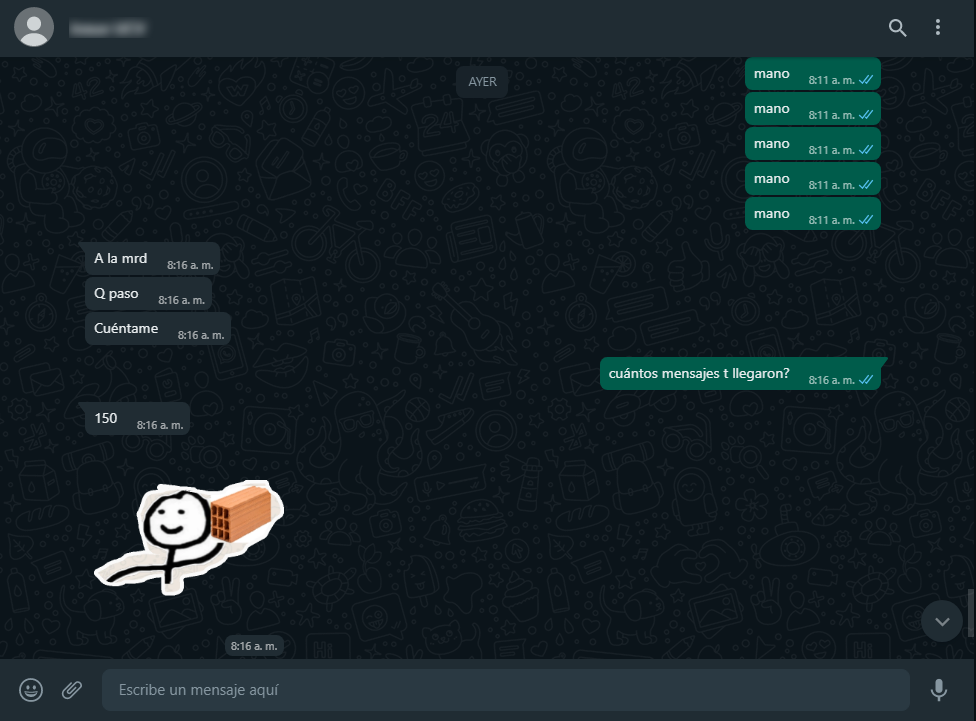

# WhatsApp Bomba :bomb:

Este código está hecho con el fin de usarse para propósitos no maliciosos. Diviértete usándolo pero no sobrepases los límites.
\
&nbsp;

## Instalación:

```
> git clone https://github.com/Letalandroid/wssp-bomba.git
```

## Librerías a usar:

```
PyAutogui
Time
```
&nbsp;

## Manual de uso:


### Windows:


Iniciamos el app.py con python3 y vamos escribiendo tanto el mensaje a enviar como la cantidad de mensaje, en este caso el mensaje será "Hola Mundo" y será enviado 5 veces.

Para luego esperar que el usuario tenga abierto el WhatsApp



Una vez dado al Enter, comenzrá un contador para que al usuario le de tiempo de poner el cursor sobre la barra donde va el mensaje para luego ir mandando de uno en uno cada mensaje.




Para el test se usa un bloc de notas pero también se puede usar en el WhatsApp Web.



Un ejemplo en WhatsApp Web enviando 150 mensajes con el mensaje de "mano".
\
&nbsp;

## Inicia con el comando:

```
>>> py app.py
```
&nbsp;

Y diviértete con usándolo :smile:


